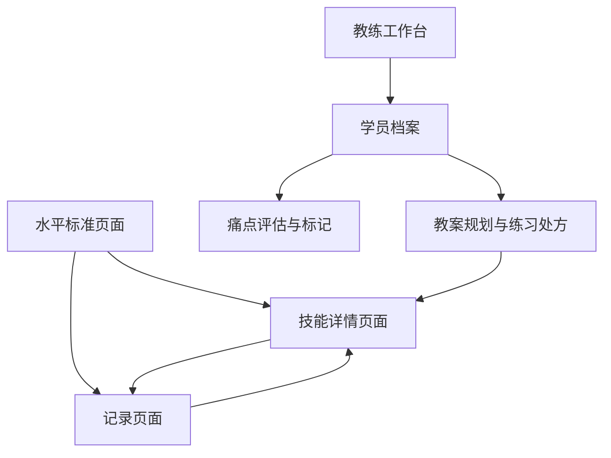

## 1. Product Overview
网球技能提升应用是一款帮助用户系统学习和记录网球技能，同时为网球教练提供强大教学辅助工具的移动端应用 (支持 iOS/Android 双端)。
- **针对新手与进阶球员**：提供从1.0到5.0的网球水平标准（以0.5为间隔）和技能树，帮助用户清晰了解自己的技能水平、提升路径以及学习预期。针对不同技能提供详细动作指导、常见错误（痛点）分析，并支持用户记录学习心得。
- **针对网球教练**：提供学员档案管理、技能掌握情况追踪、痛点精准标记以及基于痛点的针对性练习（Drills）处方推荐，支持为学员定制每节课的教案规划，实现数据化教学。

## 2. Core Features

### 2.1 User Roles
| Role | Registration Method | Core Permissions |
|------|---------------------|------------------|
| Normal User (Student) | AsyncStorage 本地存储 (免注册) | 浏览水平标准与技能，记录个人心得与备忘录 |
| Coach (教练) | AsyncStorage 本地存储 (免注册，通过设置切换模式) | 管理多个学员档案，评估学员进度，标记技能痛点，生成针对性练习处方，制定单节课教案 |

### 2.2 Feature Module
1. **水平标准页面**：1.0-5.0水平标准细则（以0.5为间隔），学习预期时间，技能树展示，技能checklist。
2. **技能页面**：技能分类展示，详细技能信息（图文/视频链接），**常见痛点（易犯错误）分析**，**针对性练习处方（Drills）推荐**。
3. **记录页面**：技能备忘录，心得记录，技巧管理。
4. **教练工作台（新增）**：学员列表与档案管理，单学员技能掌握状态评估，单节课教案规划（Lesson Planner）。

### 2.3 Page Details
| Page Name | Module Name | Feature description |
|-----------|-------------|---------------------|
| 水平标准页面 (Tab 1) | 水平标准列表 | 底部 Tab 导航第一个，图标为 `Target`。展示各水平标准、技能要求与**预期练习投入** |
| 水平标准页面 | 技能树/Checklist| 分为“已掌握”和“新技能”，支持自动滚动定位 |
| 技能页面 (Tab 2) | 技能分类 | 底部 Tab 导航第二个，图标为 `CheckSquare`。按分类筛选展示所有技能 |
| 技能页面 | 技能详情 | 详细说明、动作示范、技术要点。**新增「常见痛点」列表与对应的「练习处方（Drills）」指导。支持动作示范图片点击全屏预览与双指缩放** |
| 记录页面 (Tab 3) | 技能备忘录 | 底部 Tab 导航第三个，图标为 `BookOpen`。记录日期和时间、通用备忘录 |
| 教练页面 (Tab 4) | 学员列表 | 底部 Tab 导航第四个，图标为 `Users`。展示所有学员的简要进度和最近上课时间 |
| 教练页面 | 学员档案 | 查看特定学员的整体技能掌握进度、各项技能的痛点标记、历史课程记录 |
| 教练页面 | 教案规划 | 为学员的某节课创建教案：选择本节课重点突破的技能与痛点，系统自动推荐或教练手动挑选练习处方（Drills），并可填写课后总结 |

### 2.4 水平标准细则与预期管理
| 水平 | 描述 | 技能要求 | 预期学习投入 (供参考) |
|------|------|----------|-----------------------|
| 1.0 | 初学者（包括第一次打网球的人） | 正在学习如何握拍、击球和计分 | 1-5 小时 |
| 1.5 | 有限经验，主要致力于将球打回场内 | 击球时间不长，还不能控制落点 | 10-20 小时 |
| 2.0 | 缺乏球场经验，击球技术需要发展 | 正手挥拍不完整，发球抛球不稳定 | 30-50 小时 |
| 2.5 | 正在学习判断球的方向，球场覆盖有限 | 能慢速对攻，能主动挑高球 | 60-100 小时 |
| 3.0 | 打中速球相当稳定，但对所有击球都不舒适 | 能控制击球方向，缺乏击球深度 | 1-2 年 (规律练习) |
| 3.5 | 中速球方向控制不错，深度和变化不够 | 稳定回击过顶球，开始随球上网 | 2-3 年 (规律练习) |
| 4.0 | 击球有相当把握，回击中速球有深度 | 控制击球深度和方向，能打出得分球 | 3-5 年+ (含比赛经验) |
| 4.5 | 力量和稳定性已经成为主要武器 | 提前预判准备，能变化战术和风格 | 业余高水平选手 |
| 5.0 | 有良好的击球预判能力，经常有出色的击球 | 定期打出制胜球，成功执行各类复杂技术 | 准专业/专业退役 |

### 2.5 痛点与练习处方机制 (Pain Points & Drills)
为了帮助新手自我纠错并辅助教练教学，引入痛点与处方机制：
- **痛点 (Pain Point)**：每个技能下包含常见的易犯错误。例如正手基础击球的痛点包括：“击球点太靠后”、“引拍过大”、“没有转体”。
- **练习处方 (Drill)**：针对特定痛点的纠正性练习。例如针对“击球点太靠后”，推荐的处方练习为“教练手抛球，学员在身前抓球练习”。
- **应用场景**：学员在技能详情页可对照痛点自查；教练在学员档案中可直接将某技能标记为“包含特定痛点”，在排课时系统会高亮显示并直接关联对应的处方练习。

## 3. Core Process
**用户（学生）流程：**
1. 访问应用，查看水平标准与预期投入。
2. 浏览技能详情，对照「常见痛点」自查动作，查看「练习处方」进行自我纠正。
3. 记录学习心得和备忘录。

**教练流程：**
1. 切换至教练模式（Tab 4）。
2. 添加/管理学员档案。
3. 评估学员技能，勾选已掌握技能，并为未掌握/有缺陷的技能标记具体「痛点」。
4. 为学员创建「新教案」，选择本节课的重点技能与痛点，系统自动列出对应的「练习处方」。
5. 完成教学后，在教案中记录课后总结与学员反馈。

## 4. User Interface Design
### 4.1 Design Style
- 主色调：#2C3E50（深蓝）、#3498DB（亮蓝）、#DFFF00（网球荧光黄）
- 辅助色：#E74C3C（红色）、#27AE60（绿色）、#F39C12（橙色，用于高亮痛点）
- 品牌资产：深蓝底色搭配荧光黄网球矢量图案的 App 图标与启动页
- 布局风格：卡片式布局，底部 Tab 导航栏

### 4.2 Page Design Overview
| Page Name | Module Name | UI Elements |
|-----------|-------------|-------------|
| 水平标准页面 | 水平标准列表 | 卡片式设计，增加「预期时间」徽章 |
| 技能页面 | 技能详情 | 原生全屏页面。内容区新增折叠面板展示「常见痛点」与「针对性练习处方」 |
| 教练页面 | 学员列表 | 列表布局，每个卡片显示学员头像占位符、当前等级、上次上课时间 |
| 教练页面 | 学员详情与教案 | 顶部分段选择器 (Segmented Control) 切换「技能评估」与「历史教案」。教案卡片包含日期、重点技能标签和练习清单 |

### 4.3 Responsiveness & Input UX
- 专为移动设备优化的原生体验，自适应 Safe Area。
- 表单和文本输入区域支持**智能键盘避让** (KeyboardAvoidingView + useHeaderHeight)。

### 4.4 3D Scene Guidance
- 无3D场景需求