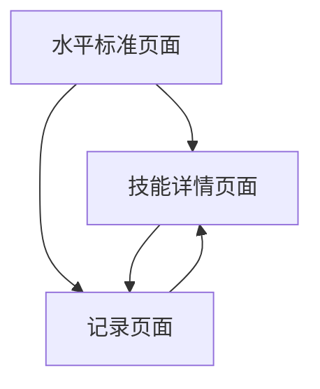

## 1. Product Overview
网球技能提升应用是一款帮助用户系统学习和记录网球技能的移动端应用 (支持 iOS/Android 双端)。
- 为用户提供从1.0到5.0的网球水平标准（以0.5为间隔）和技能树，帮助用户清晰了解自己的技能水平和提升路径。
- 针对不同技能（正手、反手、发球等）提供详细学习资料，并支持用户记录学习心得和技巧。

## 2. Core Features

### 2.1 User Roles
| Role | Registration Method | Core Permissions |
|------|---------------------|------------------|
| Normal User | AsyncStorage 本地存储 (免注册) | Access all features, save notes locally |

### 2.2 Feature Module
1. **水平标准页面**：1.0-5.0水平标准细则（以0.5为间隔），技能树展示，技能checklist
2. **技能页面**：技能分类展示，详细技能信息，学习资料
3. **记录页面**：技能备忘录，心得记录，技巧管理

### 2.3 Page Details
| Page Name | Module Name | Feature description |
|-----------|-------------|---------------------|
| 水平标准页面 (Tab 1) | 水平标准列表 | 底部 Tab 导航第一个，图标为 `Target`。展示1.0-5.0每个水平（以0.5为间隔）的详细标准和要求 |
| 水平标准页面 | 技能树 | 可视化展示技能之间的关联和进阶路径 |
| 水平标准页面 | 技能checklist | 针对每个水平的技能要求提供勾选功能。**在技能展示上，每个等级将技能分为两部分：“已掌握技能”（上一级已要求的技能，默认折叠）和“进阶需要掌握的新技能”（当前级新增技能，默认展开）**，从而帮助用户既能聚焦进阶需掌握的新知识点，也能随时展开回顾前置技能。同时，页面加载时系统会自动滚动定位到用户当前首个未完全通关的等级区域。 |
| 技能页面 (Tab 2) | 技能分类 | 底部 Tab 导航第二个，图标为 `CheckSquare`。按分类筛选展示所有技能 |
| 技能页面 | 技能详情 | 每个技能的详细说明、技术要点和学习建议，提供返回按钮方便用户导航（可从任意页面点击进入并正确返回上一级页面） |
| 记录页面 (Tab 3) | 技能备忘录 | 底部 Tab 导航第三个，图标为 `BookOpen`。针对每个技能的心得记录和技巧保存，每次记录包含日期和时间 |
| 记录页面 | 通用备忘录 | 通用的心得记录和技巧保存，每次记录包含日期和时间 |
| 记录页面 | 备忘录管理 | 查看、编辑和删除已保存的备忘录 |

### 2.4 水平标准细则
| 水平 | 描述 | 技能要求 |
|------|------|----------|
| 1.0 | 初学者（包括第一次打网球的人） | 正在学习如何握拍、击球和计分 |
| 1.5 | 有限经验，主要致力于将球打回场内 | 击球时间不长，还只顾得上把球来回打起来而不能控制球的落点 |
| 2.0 | 缺乏球场经验，击球技术需要发展 | 正手：挥拍动作不完整，不容易控制击球方向；反手：不愿意用反手接球；发球：动作不完整，抛球不稳定 |
| 2.5 | 正在学习判断球的方向，球场覆盖有限 | 能与同水平选手进行慢速对攻；能主动挑高球，但还不能控制球的高度和深度 |
| 3.0 | 打中速球时相当稳定，但对所有击球都不舒适 | 能控制击球方向，但缺乏击球深度；双打中最常见的阵型是一前一后 |
| 3.5 | 中速球的方向控制已经不错，但击球的深度和变化还不够 | 能在跑动中稳定地回击过顶球，开始能随球上网、放小球和打反弹球 |
| 4.0 | 击球已经有相当的把握，回击中速球有深度 | 能打出有把握的中速正、反手边线球，能控制击球的深度和方向；能抓住机会打出得分球 |
| 4.5 | 力量和稳定性已经成为主要武器 | 能根据对手的动作进行判断，为自己下一拍进攻提前准备；在激烈的比赛中能变化战术和风格 |
| 5.0 | 有良好的击球预判能力，经常有出色的击球 | 能定期打出制胜球或迫使对手失误；能成功执行高球、放小球、半截击、高压球等技术 |

## 3. Core Process
用户流程：
1. 用户访问应用，默认进入水平标准页面
2. 浏览不同水平的标准和技能要求
3. 点击技能进入技能详情页面学习
4. 在技能页面或记录页面添加学习心得和技巧
5. 在记录页面查看和管理所有备忘录

## 4. User Interface Design
### 4.1 Design Style
- 主色调：#2C3E50（深蓝）、#3498DB（亮蓝）、#DFFF00（网球荧光黄）
- 辅助色：#E74C3C（红色）、#27AE60（绿色）
- 品牌资产 (Brand Assets)：
  - App 主图标 (Icon)：深蓝底色搭配荧光黄网球矢量图案
  - 启动页 (Splash Screen)：深蓝底色，居中显示网球图案与 "All Level Tennis" 品牌名称
- 按钮风格：圆角设计
- 字体：系统默认无衬线字体，主标题18-24px，正文14-16px
- 布局风格：卡片式布局，底部 Tab 导航栏
- 图标风格：简约线条图标 (Lucide React Native)，使用网球相关元素

### 4.2 Page Design Overview
| Page Name | Module Name | UI Elements |
|-----------|-------------|-------------|
| 水平标准页面 | 水平标准列表 | 卡片式设计，每个水平一个卡片，包含技能列表和进度条 |
| 技能页面 | 技能分类 | 顶部横向滚动分类栏，网格布局展示技能图标卡片 |
| 技能页面 | 技能详情 | 移动端原生全屏页面（带返回 Header），包含图文教程链接、技术要点和备忘录输入框 |
| 记录页面 | 技能备忘录 | 列表式布局，每个备忘录卡片包含技能标签、日期和内容预览 |

### 4.3 Responsiveness & Input UX
- 专为移动设备 (iOS / Android) 优化的原生体验
- 自适应不同尺寸的手机屏幕和安全区 (Safe Area)
- 触摸设备优化，增大可点击区域，支持手势操作和原生滚动机制
- **输入体验优化**：表单和文本输入区域（如技能详情页底部的备忘录）支持**智能键盘避让**，确保键盘弹出时输入框自动平移至可视区域而不被遮挡。对于原本就在顶部的输入区域（如通用备忘录）则保持原位。

### 4.4 3D Scene Guidance
- 无3D场景需求