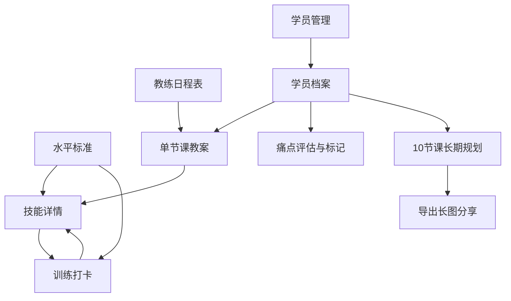

## 1. Product Overview
网球技能提升应用是一款帮助用户系统学习和记录网球技能，同时为网球教练提供强大教学辅助工具的移动端应用 (支持 iOS/Android 双端)。
- **针对新手与进阶球员**：提供从1.0到5.0的网球水平标准（以0.5为间隔）和技能树，帮助用户清晰了解自己的技能水平、提升路径以及学习预期。针对不同技能提供详细动作指导、常见错误（痛点）分析，并支持用户记录学习心得。
- **针对网球教练**：提供学员档案管理、技能掌握情况追踪、痛点精准标记以及基于痛点的针对性练习（Drills）处方推荐，支持为学员定制每节课的教案规划，实现数据化教学。

## 2. Core Features

### 2.1 User Roles
| Role | Registration Method | Core Permissions | Tab 导航分布 |
|------|---------------------|------------------|--------------|
| Normal User (Student) | AsyncStorage 本地存储 (免注册) | 浏览水平标准与技能，进行结构化的训练打卡记录 | 水平标准、技能、打卡记录 |
| Coach (教练) | AsyncStorage 本地存储 (免注册，通过设置切换模式) | 管理多学员档案与单/长期教案，管理每日教学日程 | 水平标准、技能、日程表、学员管理 |

### 2.2 Feature Module
1. **水平标准页面 (公用)**：1.0-5.0水平标准细则（以0.5为间隔），学习预期时间，技能树展示，技能checklist。
2. **技能页面 (公用)**：技能分类展示，详细技能信息（图文/视频链接），常见痛点分析，针对性练习处方推荐。**支持全局备忘录入口，以及在各个技能详情中记录专有心得。**
3. **训练打卡 (学生专属)**：结构化的训练记录（记录日期、时长、重点练习技能、自由备注）。
4. **教练日程 (教练专属)**：以网格式时间轴展示当日课程安排，支持直接点击空白时段快捷排课，以及长按拖拽课程卡片来修改上课时间。
5. **学员管理 (教练专属)**：学员档案管理，技能痛点评估，单节课教案规划，以及**10节课长期规划（Blueprint）与长图导出分享**。

### 2.3 Page Details
| Page Name | Module Name | Feature description |
|-----------|-------------|---------------------|
| 水平标准 (Tab 1) | 水平标准列表 | 底部 Tab 导航第一个，图标为 `Target`。展示各水平标准、技能要求与**预期练习投入** |
| 水平标准页面 | 技能树/Checklist| 分为“已掌握”和“新技能”，支持自动滚动定位 |
| 技能页面 (Tab 2) | 技能分类 | 底部 Tab 导航第二个，图标为 `CheckSquare`。按分类筛选展示所有技能。**左上角提供全局备忘录管理入口，每个技能卡片右上角显示关联的备忘录数量角标。** |
| 技能页面 | 技能详情 | 详细说明、动作示范、技术要点、常见痛点列表与对应的练习处方指导。支持动作示范图片点击全屏预览与双指缩放。**支持在该页面底部直接记录当前技能的心得，并展示该技能的历史备忘录列表。** |
| 技能页面 | 备忘录管理 | 通过技能分类页左上角进入，统一展示和管理用户所有的通用备忘录及关联技能的备忘录，支持删除。 |
| 打卡记录 (Tab 3 - 学生) | 训练打卡 | 学生模式专属 Tab 3，图标为 `BookOpen`。默认展示日历模式，标记有打卡记录的日期，下方展示具体详情。支持快捷录入时长与多选技能。 |
| 教练日程 (Tab 3 - 教练) | 日程表 | 教练模式专属 Tab 3，图标为 `Calendar`。基于小时和半小时分隔的垂直时间轴。支持点击空白网格快捷创建教案，支持长按拖拽课程卡片更改时间，时间重叠时卡片自适应并排显示。**非核心排课时段（06:00-08:00 及 22:00-24:00）默认折叠，减少无谓滑动；当该时段有排课时自动展开，也支持用户手动点击展开。** |
| 学员管理 (Tab 4 - 教练) | 学员列表 | 教练模式专属 Tab 4，图标为 `Users`。展示所有学员的简要进度和最近上课时间 |
| 学员管理 | 学员档案 | 查看特定学员的整体技能掌握进度、各项技能的痛点标记、历史课程记录。**头部直观展示该学员最近的打球场地，历史教案卡片同步展示场地信息。** |
| 学员管理 | 单节教案规划 | 为学员的某节课创建教案：选择重点突破技能与痛点，关联练习处方，填写训练场地与课后总结。**支持在不强制绑定已有学员档案的情况下直接输入名字排课，并在保存时智能询问是否建档；支持自动提取该学员的历史打球地址以供快捷点选。** |
| 学员管理 | 10节课长期规划 | 为学员设定长期学习蓝图，依次为第1至第10节课规划重点技能，**支持一键生成精美排版并导出长图分享给学员** |

### 2.4 水平标准细则与预期管理
| 水平 | 描述 | 技能要求 | 预期学习投入 (供参考) |
|------|------|----------|-----------------------|
| 1.0 | 初学者（包括第一次打网球的人） | 正在学习如何握拍、击球和计分 | 1-5 小时 |
| 1.5 | 有限经验，主要致力于将球打回场内 | 击球时间不长，还不能控制落点 | 10-20 小时 |
| 2.0 | 缺乏球场经验，击球技术需要发展 | 正手挥拍不完整，发球抛球不稳定 | 30-50 小时 |
| 2.5 | 正在学习判断球的方向，球场覆盖有限 | 能慢速对攻，能主动挑高球 | 60-100 小时 |
| 3.0 | 打中速球相当稳定，但对所有击球都不舒适 | 能控制击球方向，缺乏击球深度，**开始掌握正反手基础上旋** | 1-2 年 (规律练习) |
| 3.5 | 中速球方向控制不错，深度和变化不够 | 稳定回击过顶球，开始随球上网，**上旋击球逐渐稳定** | 2-3 年 (规律练习) |
| 4.0 | 击球有相当把握，回击中速球有深度 | 控制击球深度和方向，能打出得分球，**掌握正反手强烈上旋** | 3-5 年+ (含比赛经验) |
| 4.5 | 力量和稳定性已经成为主要武器 | 提前预判准备，能变化战术和风格，**熟练使用上旋挑高球防守或穿越** | 业余高水平选手 |
| 5.0 | 有良好的击球预判能力，经常有出色的击球 | 定期打出制胜球，成功执行各类复杂技术（含各面上旋变线） | 准专业/专业退役 |

### 2.5 痛点与练习处方机制 (Pain Points & Drills)
为了帮助新手自我纠错并辅助教练教学，引入痛点与处方机制：
- **痛点 (Pain Point)**：每个技能下包含常见的易犯错误。例如正手基础击球的痛点包括：“击球点太靠后”；**正手上旋的痛点包括：“击球太平，没有摩擦导致出界”**。
- **练习处方 (Drill)**：针对特定痛点的纠正性练习。例如针对“击球点太靠后”，推荐的处方练习为“身前抓球练习”；**针对“击球太平没有摩擦”，推荐的处方练习为“雨刷器挥拍练习”**。
- **应用场景**：学员在技能详情页可对照痛点自查；教练在学员档案中可直接将某技能标记为“包含特定痛点”，在排课时系统会高亮显示并直接关联对应的处方练习。

## 3. Core Process
**用户（学生）流程：**
1. 访问应用，查看水平标准与预期投入。
2. 浏览技能详情，对照「常见痛点」自查动作，查看「练习处方」进行自我纠正。
3. 使用「训练打卡」功能记录每天/每次打网球的时间、时长及重点练习技能。

**教练流程：**
1. 切换至教练模式，导航栏自动更新为教练专属布局。
2. 在「日程表」中查看并管理每天的排课日程。
3. 在「学员管理」中添加并维护学员档案，评估技能并标记「痛点」。
4. 为学员创建单节课「教案」，选择重点技能与练习处方，记录课后总结。
5. 为学员制定「10节课长期规划」，一键导出为长图发给学员作为学习蓝图。

## 4. User Interface Design
### 4.1 Design Style
- 主色调：#2C3E50（深蓝）、#3498DB（亮蓝）、#DFFF00（网球荧光黄）
- 辅助色：#E74C3C（红色）、#27AE60（绿色）、#F39C12（橙色，用于高亮痛点）
- 品牌资产：深蓝底色搭配荧光黄网球矢量图案的 App 图标与启动页
- 布局风格：卡片式布局，底部 Tab 导航栏

### 4.2 Page Design Overview
| Page Name | Module Name | UI Elements |
|-----------|-------------|-------------|
| 水平标准页面 | 水平标准列表 | 卡片式设计，增加「预期时间」徽章 |
| 技能页面 | 技能详情 | 原生全屏页面。内容区新增折叠面板展示「常见痛点」与「针对性练习处方」 |
| 教练页面 | 学员列表 | 列表布局，每个卡片显示学员头像占位符、当前等级、上次上课时间 |
| 教练页面 | 学员详情与教案 | 顶部分段选择器 (Segmented Control) 切换「技能评估」与「历史教案」。教案卡片包含日期、重点技能标签和练习清单 |

### 4.3 Responsiveness & Input UX
- 专为移动设备优化的原生体验，自适应 Safe Area。
- 表单和文本输入区域支持**智能键盘避让** (KeyboardAvoidingView + useHeaderHeight)。

### 4.4 3D Scene Guidance
- 无3D场景需求