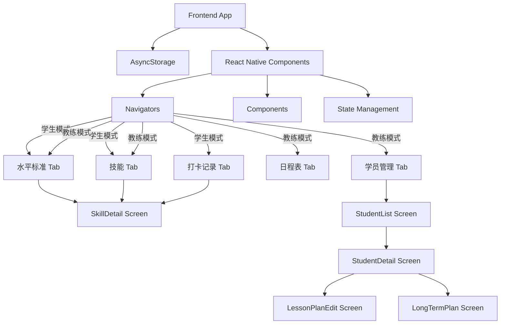
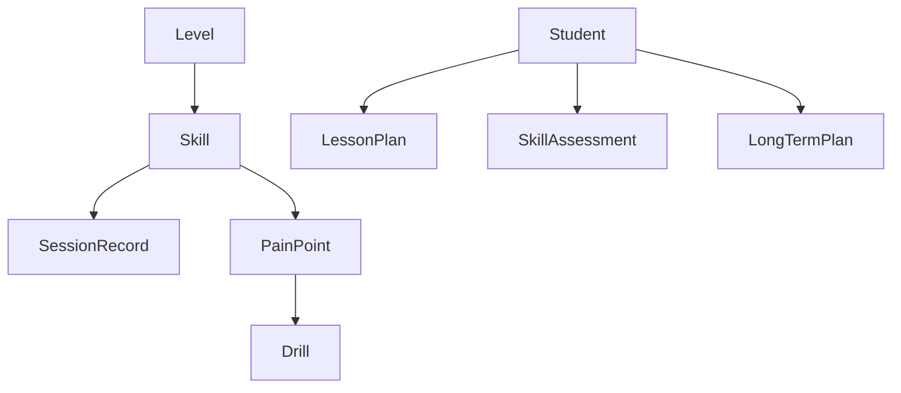

## 1. Architecture Design


## 2. Technology Description
- Frontend: React Native + Expo + TypeScript
- Backend: None (使用本地存储)
- Database: AsyncStorage (React Native 异步持久化存储)
- State Management: Zustand + persist middleware
- UI Library: React Native 原生 StyleSheet + Lucide React Native (图标)
- Navigation: React Navigation (Bottom Tabs + Native Stack)
- Image Viewer: react-native-image-zoom-viewer (用于图片全屏双指缩放预览)
- Image Export: react-native-view-shot (用于截取10节课规划为长图), expo-sharing (用于系统原生分享)

## 3. Route Definitions
| Route/Screen | Purpose | Icon |
|-------|---------|------|
| LevelStandardTab | 底部导航 - 水平标准主页栈 (双模式公用) | Target |
| SkillsTab | 底部导航 - 技能主页栈 (双模式公用) | CheckSquare |
| TrainingRecordTab | 底部导航 - 打卡记录主页栈 (仅学生模式) | BookOpen |
| ScheduleTab | 底部导航 - 日程表主页栈 (仅教练模式) | Calendar |
| StudentsTab | 底部导航 - 学员管理主页栈 (仅教练模式) | Users |
| LevelStandard | 水平标准列表展示 | - |
| SkillsList | 技能列表及横向分类筛选 | - |
| TrainingRecordList| 训练打卡记录列表 | - |
| SkillDetail | 技能详情页面（可在任意 Tab 栈内压入并正确返回上一级） | - |
| ScheduleList | 教练日程表视图 | - |
| StudentList | 学员列表页面 | - |
| StudentDetail | 单个学员档案页面（技能评估、单节教案与长期规划） | - |
| LessonPlanEdit| 单节教案编辑页面（选择重点技能、痛点与练习处方） | - |
| LongTermPlanEdit| 10节课长期规划页面（包含长图截图分享功能） | - |

## 4. API Definitions
- 无后端API，使用本地存储模拟数据持久化

## 5. Server Architecture Diagram
- 无服务器架构，纯前端应用

## 6. Data Model
### 6.1 Data Model Definition


### 6.2 Data Definition Language

**Level数据结构**
```typescript
interface Level {
  id: string;       // 水平ID，如"0", "1.0", "2.5"等
  name: string;     // 水平名称
  description: string; // 水平描述
  skills: string[]; // 该水平需要掌握的技能ID列表
  expectedTime?: string; // 预期练习投入时间
}
```

**Skill数据结构**
```typescript
interface PainPoint {
  id: string;
  description: string; // 痛点描述，例如“击球点太靠后”
  recommendedDrillIds: string[]; // 推荐的练习处方ID
}

interface Skill {
  id: string;       // 技能ID
  name: string;     // 技能名称
  category: string; // 技能分类（正手、反手、发球等）
  description: string; // 技能描述
  tips: string[];   // 技能技巧
  difficulty: number; // 技能难度（1-5）
  imageUrl?: string; // 技能相关动作的配图URL
  painPoints?: PainPoint[]; // 常见痛点分析与推荐练习
}
```

**Drill (练习处方) 数据结构**
```typescript
interface Drill {
  id: string;
  name: string;
  description: string;
  steps: string[];
  difficulty: number;
}
```

**SessionRecord (训练打卡) 数据结构**
```typescript
interface SessionRecord {
  id: string;
  date: string;      // 打卡日期
  duration: number;  // 训练时长（例如 1.5 小时）
  focusSkillIds: string[]; // 本次练习的重点技能
  notes: string;     // 自由备注/心得
  createdAt: string;
  updatedAt: string;
}
```

**Student (学员档案) 与 LessonPlan (教案) 数据结构**
```typescript
interface SkillAssessment {
  skillId: string;
  completed: boolean;
  painPointIds: string[]; // 学员在该技能上存在的痛点
}

interface StudentProfile {
  id: string;
  name: string;
  avatar?: string;
  currentLevelId: string;
  assessments: Record<string, SkillAssessment>; // key 为 skillId
  lastLessonDate?: string;
}

interface LessonPlan {
  id: string;
  studentId: string;
  date: string;
  startTime?: string; // 用于日程表视图 (如 "14:00")
  endTime?: string;   // 用于日程表视图 (如 "15:30")
  focusSkillIds: string[];
  selectedDrillIds: string[];
  coachNotes: string;
}

interface LongTermPlanLesson {
  lessonNumber: number; // 课时序号 (1-10)
  focusSkillIds: string[]; // 本节课重点技能
  description: string;  // 本节课阶段目标
}

interface LongTermPlan {
  id: string;
  studentId: string;
  title: string; // 例如 "正手底线相持进阶 10节课规划"
  lessons: LongTermPlanLesson[];
  createdAt: string;
}
```

### 6.3 初始数据示例 (部分)

**Drill数据**：
```typescript
const drills: Drill[] = [
  {
    id: "drill-fh-catch",
    name: "身前抓球练习",
    description: "纠正击球点过后的问题",
    steps: ["教练在网前手抛球", "学员不拿拍，用非持拍手在身前抓住球", "体会重心前移与身前击球的空间感"],
    difficulty: 1
  },
  {
    id: "drill-topspin-wiper",
    name: "雨刷器挥拍练习",
    description: "纠正击球太平、缺乏摩擦的问题",
    steps: ["在围网前或铁丝网前练习", "拍面贴着网面，从下往上做雨刷器动作", "体会拍面与球网（模拟球）的摩擦感"],
    difficulty: 2
  }
];
```

**Skill数据（附带痛点）**：
```typescript
const skills = [
  { 
    id: "forehand-basic", 
    name: "正手基础击球", 
    category: "正手", 
    description: "基本的正手击球动作", 
    tips: ["保持正确的握拍", "转动身体带动挥拍"], 
    difficulty: 1,
    painPoints: [
      { id: "pp-fh-late", description: "击球点太靠后", recommendedDrillIds: ["drill-fh-catch"] },
      { id: "pp-fh-arm", description: "纯手臂发力，无转体", recommendedDrillIds: ["drill-fh-core"] }
    ]
  },
  {
    id: "forehand-topspin-basic",
    name: "正手基础上旋",
    category: "正手",
    description: "掌握现代网球基本的正手上旋击球，增加过网高度和落地后的弹跳。",
    tips: ["采用半西方或西方式握拍", "拍头低于击球点", "由下至上刷球", "像雨刷器一样的随挥动作"],
    difficulty: 3,
    painPoints: [
      { id: "pp-fh-topspin-flat", description: "击球太平，没有摩擦导致出界", recommendedDrillIds: ["drill-topspin-wiper"] }
    ]
  }
  // ... 其他技能
];
```

## 7. 新增功能实现

### 7.1 返回按钮及多端导航功能
- **实现位置**：`SkillDetail.tsx` 以及 `navigation/AppNavigator.tsx`
- **功能描述**：在技能详情页面顶部添加返回按钮，确保用户不论从哪个 Tab 点击进入技能详情，返回时都能回到进入前所在的 Tab 栈内上一页面。
- **技术实现**：
  - 弃用全局单栈路由，将 Bottom Tabs 下的每个 Tab 分别配置为独立的 Native Stack Navigator。
  - 使用 React Navigation 的 `navigation.goBack()` 配合各栈内的历史记录进行独立回退。

### 7.2 App 品牌图标与启动页适配 (Brand Assets)
- **技术实现**：在 `app.json` 中配置深蓝色与荧光黄的品牌图标与启动页，使用 `npx expo prebuild` 同步。

### 7.3 全局技能状态同步
- **技术实现**：通过 Zustand 的 `skillCompletion` 状态存储全局的完成情况，多层级共享同一技能的完成进度。

### 7.4 键盘避让与输入体验优化
- **技术实现**：使用 `KeyboardAvoidingView` 与 `behavior="position"`，结合 `@react-navigation/elements` 的 `useHeaderHeight()` 动态偏移。

### 7.5 等级新增技能展示与智能定位
- **技术实现**：差集计算出相比上一级的新增技能，并使用 `FlatList` 的 `scrollToIndex` 在页面加载时自动滚动到首个未通关等级。

### 7.6 痛点与练习处方推荐系统 (Pain Points & Drills)
- **实现位置**：`store/drillStore.ts`, `SkillDetailScreen.tsx`
- **功能描述**：技能详情页不仅展示技巧，还展示学员可能遇到的痛点及纠正该痛点的练习方法。
- **技术实现**：
  - 在 Zustand 中维护一份只读的 `drills` 字典。
  - 在 `SkillDetailScreen` 渲染时，遍历 `skill.painPoints`，并根据 `recommendedDrillIds` 映射出具体的 `Drill` 数据渲染为折叠卡片。

### 7.7 教练工作台与教案管理 (Coach Dashboard & Lesson Planner)
- **实现位置**：`navigation/CoachStack.tsx`, `StudentListScreen.tsx`, `StudentDetailScreen.tsx`, `LessonPlanEditScreen.tsx`, `store/coachStore.ts`
- **功能描述**：教练可管理学员档案，评估技能痛点，并基于痛点生成包含具体 Drill 的单节课教案。
- **技术实现**：
  - **状态管理**：新增 `useCoachStore`，利用 `persist` 中间件将 `students` 和 `lessonPlans` 持久化到 AsyncStorage。
  - **学员档案页**：采用顶部分段器切换视图。技能评估视图以列表呈现该学员当前水平的技能，教练可勾选完成或标记 `painPointIds`；头部信息区动态提取该学员最近一次有场地记录的 `location` 渲染地图图钉提示；历史教案列表同样展示该次上课的具体位置。
  - **教案编辑页**：表单界面。
    - **脱离档案排课**：支持直接输入 `studentName` 排课，并在保存时拦截弹窗确认是否调用 `addStudent` 同步生成新档案。同时通过动态计算历史 `location` 渲染快捷场地选择筹码。
    - **智能处方推荐**：当教练选择某个包含痛点的重点技能时，系统自动从 `drills` 库中拉取对应的 `Drill` 推荐列表，教练可一键添加至 `selectedDrillIds` 并在课后写入总结 `coachNotes`。

### 7.8 图片全屏预览与双指缩放
- **实现位置**：`SkillDetailScreen.tsx`
- **功能描述**：技能详情页的技能配图支持点击放大，并在全屏模式下支持双指缩放和手势滑动关闭。
- **技术实现**：
  - 引入第三方库 `react-native-image-zoom-viewer`。
  - 在页面组件中维护 `isImageViewVisible` 状态。
  - 使用 React Native 的 `<Modal>` 组件，将 `ImageViewer` 和自定义的关闭按钮组合在一起渲染，完美绕过缩放时强制隐藏 Header 的问题。

### 7.9 动态底部导航 (Role-Based Navigation)
- **技术实现**：在 `AppNavigator.tsx` 中，监听 Zustand `coachStore` 的 `isCoachMode` 状态，条件渲染 `Tab.Screen`，实现学生与教练端专属 Tab 栏的动态切换。

### 7.10 结构化训练打卡 (Training Record)
- **技术实现**：废弃原先单一的 `Note` 文本结构，引入 `SessionRecord` 模型，包含日期选择（自定义或近4日快捷标签）、时长步进器输入、多选关联重点技能等表单项，数据使用 AsyncStorage 持久化。引入 `react-native-calendars`，打卡列表默认以日历视图展示，有记录的日期会渲染网球绿色和对勾标记。

### 7.11 教练日程表 (Coach Schedule)
- **技术实现**：新增 `ScheduleScreen.tsx`，以垂直时间轴网格实现排课可视化。
  - **网格系统与时段折叠**：生成早上 6:00 到晚上 24:00 的绝对定位网格。为了减少无效滑动，引入 `getTimeY` 和 `getYTime` 进行非线性的时间和像素映射：默认折叠 06:00-08:00 与 22:00-24:00 的非核心时段，并渲染为点击展开的提示按钮；如果 `dailyLessons` 在这些时段内已有排课，则该时段会自动展开。在空白核心时段填充浅色文案提示，支持点击自动携带时间参数跳转排课。
  - **重叠自适应算法**：使用基于贪心着色的分组算法（Clusters & Coloring）处理时间重叠的课程，自动计算 `leftOffset` 和等分的 `cardWidth`，使重叠卡片并排显示。
  - **原生手势拖拽**：使用 `PanResponder` 结合 `Animated.ValueXY` 响应卡片拖拽。为了解决卡片拖拽与外层 `ScrollView` 滚动的冲突，在 `onMoveShouldSetPanResponder` 中引入 300ms 长按判定：快速滑动时将手势交还给 `ScrollView` 以保证页面顺畅滚动，仅在长按停顿后强制接管并锁定滚动；通过严格的位移和状态校验避免松手时误触跳转。拖拽释放后，通过非线性的 `getYTime` 计算位移 `dy` 对应的具体时间，以 15 分钟为粒度吸附并更新 Zustand 中的 `startTime` 与 `endTime`。

### 7.12 10节课长期规划与长图导出 (10-Lesson Blueprint & Image Export)
- **技术实现**：
  - 在 `StudentDetailScreen` 增加“生成长期规划”入口。
  - `LongTermPlanEditScreen` 提供批量编辑10节课预期目标的表单。
  - 使用 `react-native-view-shot` 的 `<ViewShot>` 包裹生成的预览视图卡片，调用 `capture()` 获取本地图片 URI，最后通过 `expo-sharing` 调用系统的原生分享菜单，发送给学员。

### 7.13 备忘录功能恢复与增强 (Notes Recovery & Enhancement)
- **技术实现**：
  - **数据模型并行**：在 `types/index.ts` 中恢复 `Note` 模型，与 `SessionRecord` 并行。在 Zustand (`store/index.ts`) 中恢复 `notes` 数组及其增删方法。为了防止 AsyncStorage 加载状态不确定的崩溃，读取时统一添加默认值保护（如 `(notes || []).filter(...)`）。
  - **UI 与入口**：
    - **技能详情页 (`SkillDetailScreen`)**：恢复底部的笔记输入框与历史列表，复用 `KeyboardAvoidingView` 的 `position` 避让机制保证输入体验。
    - **全局管理入口 (`SkillsScreen`)**：在屏幕左上角添加快捷按钮，跳转至独立的 `NotesScreen` 管理所有备忘录。
    - **计数角标**：在 `SkillsScreen` 渲染技能卡片时，实时计算每个技能对应的备忘录数量，若大于 0，则在卡片右上角显示带有蓝色书本图标的数字角标。

### 7.14 RN 渲染安全加固 (React Native Rendering Safety)
- **技术背景**：在 React Native 中，若在 `<Text>` 组件之外渲染了字符串（哪怕是空字符串 `""`）或数字 `0`，会导致 `Text strings must be rendered within a <Text> component.` 的致命崩溃。
- **技术实现**：
  - 全局排查并重构了所有的条件渲染逻辑。
  - 对于可能为 `0` 的数字（如 `length` 判断），将 `{count > 0 && <View>}` 重构为 `{count > 0 ? <View> : null}`。
  - 对于可能为空字符串的变量（如 `location`，`lastLessonDate` 等），将 `{str && <View>}` 重构为 `{str ? <View> : null}` 或 `{!!str && <View>}`，从而保证条件表达式的返回值严格为布尔值或 `null`。