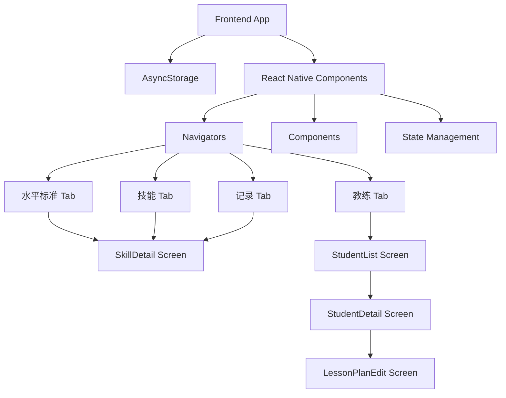
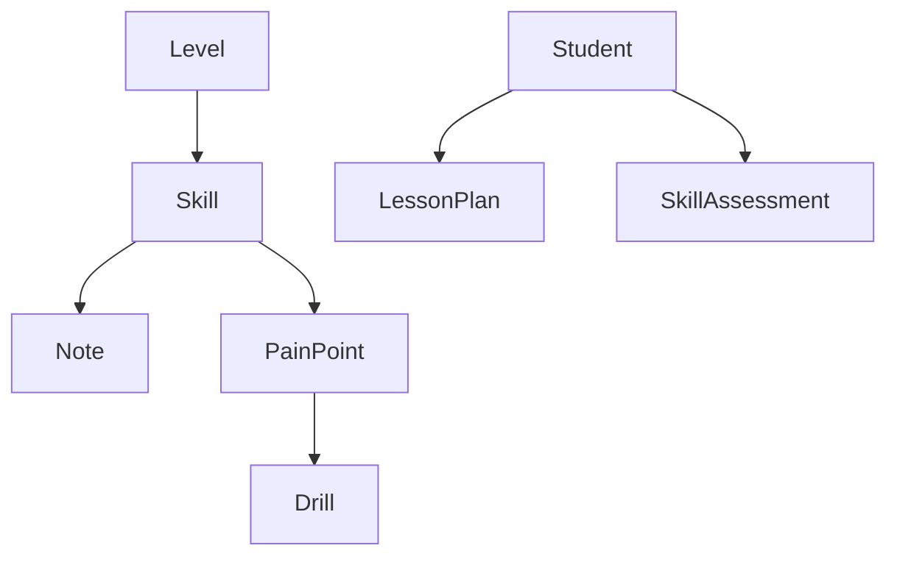

## 1. Architecture Design


## 2. Technology Description
- Frontend: React Native + Expo + TypeScript
- Backend: None (使用本地存储)
- Database: AsyncStorage (React Native 异步持久化存储)
- State Management: Zustand + persist middleware
- UI Library: React Native 原生 StyleSheet + Lucide React Native (图标)
- Navigation: React Navigation (Bottom Tabs + Native Stack)
- Image Viewer: react-native-image-zoom-viewer (用于图片全屏双指缩放预览)

## 3. Route Definitions
| Route/Screen | Purpose | Icon |
|-------|---------|------|
| LevelStandardTab | 底部导航左侧 - 水平标准主页栈 | Target |
| SkillsTab | 底部导航中间 - 技能主页栈 | CheckSquare |
| NotesTab | 底部导航右侧 - 记录主页栈 | BookOpen |
| CoachTab | 底部导航最右侧 - 教练工作台主页栈 | Users |
| LevelStandard | 水平标准列表展示 | - |
| SkillsList | 技能列表及横向分类筛选 | - |
| NotesList | 备忘录记录列表 | - |
| SkillDetail | 技能详情页面（可在任意 Tab 栈内压入并正确返回上一级） | - |
| StudentList | 学员列表页面 | - |
| StudentDetail | 单个学员档案页面（技能评估与历史教案） | - |
| LessonPlanEdit| 教案编辑页面（选择重点技能、痛点与练习处方） | - |

## 4. API Definitions
- 无后端API，使用本地存储模拟数据持久化

## 5. Server Architecture Diagram
- 无服务器架构，纯前端应用

## 6. Data Model
### 6.1 Data Model Definition


### 6.2 Data Definition Language

**Level数据结构**
```typescript
interface Level {
  id: string;       // 水平ID，如"0", "1.0", "2.5"等
  name: string;     // 水平名称
  description: string; // 水平描述
  skills: string[]; // 该水平需要掌握的技能ID列表
  expectedTime?: string; // 预期练习投入时间
}
```

**Skill数据结构**
```typescript
interface PainPoint {
  id: string;
  description: string; // 痛点描述，例如“击球点太靠后”
  recommendedDrillIds: string[]; // 推荐的练习处方ID
}

interface Skill {
  id: string;       // 技能ID
  name: string;     // 技能名称
  category: string; // 技能分类（正手、反手、发球等）
  description: string; // 技能描述
  tips: string[];   // 技能技巧
  difficulty: number; // 技能难度（1-5）
  imageUrl?: string; // 技能相关动作的配图URL
  painPoints?: PainPoint[]; // 常见痛点分析与推荐练习
}
```

**Drill (练习处方) 数据结构**
```typescript
interface Drill {
  id: string;
  name: string;
  description: string;
  steps: string[];
  difficulty: number;
}
```

**Note数据结构**
```typescript
interface Note {
  id: string;       // 笔记ID
  skillId: string;  // 关联的技能ID（为空时表示通用笔记）
  content: string;  // 笔记内容
  createdAt: string; // 创建时间（包含日期和时间）
  updatedAt: string; // 更新时间（包含日期和时间）
}
```

**Student (学员档案) 与 LessonPlan (教案) 数据结构**
```typescript
interface SkillAssessment {
  skillId: string;
  completed: boolean;
  painPointIds: string[]; // 学员在该技能上存在的痛点
}

interface StudentProfile {
  id: string;
  name: string;
  avatar?: string;
  currentLevelId: string;
  assessments: Record<string, SkillAssessment>; // key 为 skillId
  lastLessonDate?: string;
}

interface LessonPlan {
  id: string;
  studentId: string;
  date: string;
  focusSkillIds: string[];
  selectedDrillIds: string[];
  coachNotes: string;
}
```

### 6.3 初始数据示例 (部分)

**Drill数据**：
```typescript
const drills: Drill[] = [
  {
    id: "drill-fh-catch",
    name: "身前抓球练习",
    description: "纠正击球点过后的问题",
    steps: ["教练在网前手抛球", "学员不拿拍，用非持拍手在身前抓住球", "体会重心前移与身前击球的空间感"],
    difficulty: 1
  },
  {
    id: "drill-fh-core",
    name: "药球抛掷练习",
    description: "纠正手臂发力、无躯干转动的问题",
    steps: ["双手持实心药球", "模拟正手引拍动作", "蹬地转体将药球向前抛给教练"],
    difficulty: 2
  }
];
```

**Skill数据（附带痛点）**：
```typescript
const skills = [
  { 
    id: "forehand-basic", 
    name: "正手基础击球", 
    category: "正手", 
    description: "基本的正手击球动作", 
    tips: ["保持正确的握拍", "转动身体带动挥拍"], 
    difficulty: 1,
    painPoints: [
      { id: "pp-fh-late", description: "击球点太靠后", recommendedDrillIds: ["drill-fh-catch"] },
      { id: "pp-fh-arm", description: "纯手臂发力，无转体", recommendedDrillIds: ["drill-fh-core"] }
    ]
  }
  // ... 其他技能
];
```

## 7. 新增功能实现

### 7.1 返回按钮及多端导航功能
- **实现位置**：`SkillDetail.tsx` 以及 `navigation/AppNavigator.tsx`
- **功能描述**：在技能详情页面顶部添加返回按钮，确保用户不论从哪个 Tab 点击进入技能详情，返回时都能回到进入前所在的 Tab 栈内上一页面。
- **技术实现**：
  - 弃用全局单栈路由，将 Bottom Tabs 下的每个 Tab 分别配置为独立的 Native Stack Navigator。
  - 使用 React Navigation 的 `navigation.goBack()` 配合各栈内的历史记录进行独立回退。

### 7.2 App 品牌图标与启动页适配 (Brand Assets)
- **技术实现**：在 `app.json` 中配置深蓝色与荧光黄的品牌图标与启动页，使用 `npx expo prebuild` 同步。

### 7.3 全局技能状态同步
- **技术实现**：通过 Zustand 的 `skillCompletion` 状态存储全局的完成情况，多层级共享同一技能的完成进度。

### 7.4 键盘避让与输入体验优化
- **技术实现**：使用 `KeyboardAvoidingView` 与 `behavior="position"`，结合 `@react-navigation/elements` 的 `useHeaderHeight()` 动态偏移。

### 7.5 等级新增技能展示与智能定位
- **技术实现**：差集计算出相比上一级的新增技能，并使用 `FlatList` 的 `scrollToIndex` 在页面加载时自动滚动到首个未通关等级。

### 7.6 痛点与练习处方推荐系统 (Pain Points & Drills)
- **实现位置**：`store/drillStore.ts`, `SkillDetailScreen.tsx`
- **功能描述**：技能详情页不仅展示技巧，还展示学员可能遇到的痛点及纠正该痛点的练习方法。
- **技术实现**：
  - 在 Zustand 中维护一份只读的 `drills` 字典。
  - 在 `SkillDetailScreen` 渲染时，遍历 `skill.painPoints`，并根据 `recommendedDrillIds` 映射出具体的 `Drill` 数据渲染为折叠卡片。

### 7.7 教练工作台与教案管理 (Coach Dashboard & Lesson Planner)
- **实现位置**：`navigation/CoachStack.tsx`, `StudentListScreen.tsx`, `StudentDetailScreen.tsx`, `LessonPlanEditScreen.tsx`, `store/coachStore.ts`
- **功能描述**：教练可管理学员档案，评估技能痛点，并基于痛点生成包含具体 Drill 的单节课教案。
- **技术实现**：
  - **状态管理**：新增 `useCoachStore`，利用 `persist` 中间件将 `students` 和 `lessonPlans` 持久化到 AsyncStorage。
  - **学员档案页**：采用顶部分段器切换视图。技能评估视图以列表呈现该学员当前水平的技能，教练可勾选完成或标记 `painPointIds`。
  - **教案编辑页**：表单界面。当教练选择某个包含痛点的重点技能时，系统自动从 `drills` 库中拉取对应的 `Drill` 推荐列表，教练可一键添加至 `selectedDrillIds` 并在课后写入总结 `coachNotes`。

### 7.8 图片全屏预览与双指缩放
- **实现位置**：`SkillDetailScreen.tsx`
- **功能描述**：技能详情页的技能配图支持点击放大，并在全屏模式下支持双指缩放和手势滑动关闭。
- **技术实现**：
  - 引入第三方库 `react-native-image-zoom-viewer`。
  - 在页面组件中维护 `isImageViewVisible` 状态。
  - 使用 React Native 的 `<Modal>` 组件，将 `ImageViewer` 和自定义的关闭按钮组合在一起渲染，完美绕过缩放时强制隐藏 Header 的问题。