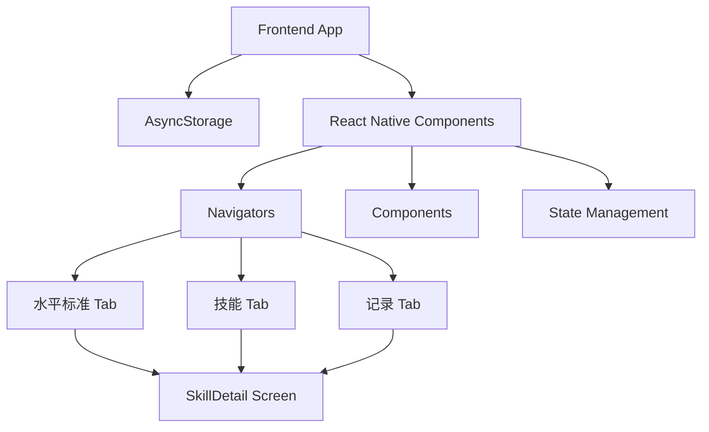
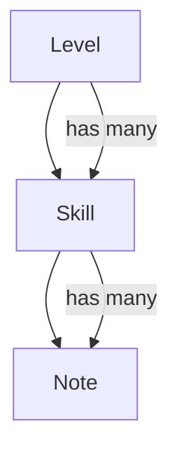

## 1. Architecture Design


## 2. Technology Description
- Frontend: React Native + Expo + TypeScript
- Backend: None (使用本地存储)
- Database: AsyncStorage (React Native 异步持久化存储)
- State Management: Zustand + persist middleware
- UI Library: React Native 原生 StyleSheet + Lucide React Native (图标)
- Navigation: React Navigation (Bottom Tabs + Native Stack)

## 3. Route Definitions
| Route/Screen | Purpose | Icon |
|-------|---------|------|
| LevelStandardTab | 底部导航左侧 - 水平标准主页栈 | Target |
| SkillsTab | 底部导航中间 - 技能主页栈 | CheckSquare |
| NotesTab | 底部导航右侧 - 记录主页栈 | BookOpen |
| LevelStandard | 水平标准列表展示 | - |
| SkillsList | 技能列表及横向分类筛选 | - |
| NotesList | 备忘录记录列表 | - |
| SkillDetail | 技能详情页面（可在任意 Tab 栈内压入并正确返回上一级） | - |

## 4. API Definitions
- 无后端API，使用本地存储模拟数据持久化

## 5. Server Architecture Diagram
- 无服务器架构，纯前端应用

## 6. Data Model
### 6.1 Data Model Definition


### 6.2 Data Definition Language
**Level数据结构**
```typescript
interface Level {
  id: string;       // 水平ID，如"0", "1.0", "2.5"等
  name: string;     // 水平名称
  description: string; // 水平描述
  skills: string[]; // 该水平需要掌握的技能ID列表
  checklist: {
    skillId: string;
    completed: boolean;
  }[]; // 技能完成情况
}
```

**Skill数据结构**
```typescript
interface Skill {
  id: string;       // 技能ID
  name: string;     // 技能名称
  category: string; // 技能分类（正手、反手、发球等）
  description: string; // 技能描述
  tips: string[];   // 技能技巧
  difficulty: number; // 技能难度（1-5）
}
```

**Note数据结构**
```typescript
interface Note {
  id: string;       // 笔记ID
  skillId: string;  // 关联的技能ID（为空时表示通用笔记）
  content: string;  // 笔记内容
  createdAt: string; // 创建时间（包含日期和时间）
  updatedAt: string; // 更新时间（包含日期和时间）
}
```

### 6.3 初始数据

**技能数据**：
```typescript
const skills = [
  // 正手相关技能
  { id: "forehand-basic", name: "正手基础击球", category: "正手", description: "基本的正手击球动作", tips: ["保持正确的握拍（推荐半西方式握拍）", "转动身体带动挥拍", "击球点在身体侧前方", "跟随动作完整", "保持手腕固定", "眼睛紧盯球"], difficulty: 1 },
  { id: "forehand-control", name: "正手方向控制", category: "正手", description: "控制正手击球的方向", tips: ["提前准备，判断来球", "瞄准目标区域", "调整拍面角度", "保持身体平衡", "随球移动", "使用小步调整"], difficulty: 2 },
  { id: "forehand-depth", name: "正手深度控制", category: "正手", description: "控制正手击球的深度", tips: ["增加击球力量", "调整击球点高度", "使用上旋", "充分转体", "跟随动作向前", "瞄准底线附近"], difficulty: 3 },
  { id: "forehand-power", name: "正手力量击球", category: "正手", description: "打出有力的正手击球", tips: ["充分转体，利用核心力量", "使用腿部力量蹬地", "击球点靠前", "加速挥拍", "保持手腕稳定", "随球跟进"], difficulty: 4 },
  { id: "forehand-variation", name: "正手变化击球", category: "正手", description: "使用不同的正手击球方式", tips: ["混合上旋和平击球", "变化节奏和速度", "调整击球角度", "使用放小球和斜线球", "根据对手位置变化球路", "保持动作一致性"], difficulty: 5 },
  
  // 反手相关技能
  { id: "backhand-basic", name: "反手基础击球", category: "反手", description: "基本的反手击球动作", tips: ["选择合适的握拍（单手或双手）", "保持平衡", "击球点在身体侧前方", "跟随动作完整", "非持拍手保持平衡", "提前准备"], difficulty: 1 },
  { id: "backhand-control", name: "反手方向控制", category: "反手", description: "控制反手击球的方向", tips: ["提前准备，判断来球", "稳定拍面", "随球移动", "调整步法", "瞄准目标", "保持身体协调"], difficulty: 2 },
  { id: "backhand-depth", name: "反手深度控制", category: "反手", description: "控制反手击球的深度", tips: ["增加击球力量", "调整击球点", "使用上旋", "充分转体", "跟随动作向前", "瞄准底线附近"], difficulty: 3 },
  { id: "backhand-power", name: "反手力量击球", category: "反手", description: "打出有力的反手击球", tips: ["充分转体，利用核心力量", "使用腿部力量蹬地", "击球点靠前", "加速挥拍", "保持手腕稳定", "随球跟进"], difficulty: 4 },
  { id: "backhand-variation", name: "反手变化击球", category: "反手", description: "使用不同的反手击球方式", tips: ["混合上旋和平击球", "变化节奏和速度", "调整击球角度", "使用切削和放小球", "根据对手位置变化球路", "保持动作一致性"], difficulty: 5 },
  
  // 发球相关技能
  { id: "serve-basic", name: "发球基础动作", category: "发球", description: "基本的发球动作", tips: ["正确的抛球（垂直上升）", "身体协调发力", "使用大陆式握拍", "跟随动作完整", "保持平衡", "眼睛紧盯球"], difficulty: 2 },
  { id: "serve-placement", name: "发球落点控制", category: "发球", description: "控制发球的落点", tips: ["瞄准目标区域", "调整抛球位置", "控制拍面角度", "根据对手位置选择落点", "保持动作一致性", "练习不同落点"], difficulty: 3 },
  { id: "serve-power", name: "发球力量", category: "发球", description: "增加发球的力量", tips: ["充分挥臂，利用鞭打效应", "使用腿部力量蹬地", "提高抛球高度", "身体协调发力", "核心力量参与", "保持动作流畅"], difficulty: 4 },
  { id: "serve-spin", name: "发球旋转", category: "发球", description: "添加旋转到发球", tips: ["调整拍面角度", "改变挥拍轨迹", "控制触球点", "练习上旋和侧旋", "保持抛球稳定", "随球动作完整"], difficulty: 4 },
  { id: "serve-variation", name: "发球变化", category: "发球", description: "使用不同类型的发球", tips: ["混合平击、上旋和切削发球", "变化节奏和速度", "调整落点", "根据对手弱点选择发球类型", "保持动作一致性", "练习不同场景的发球"], difficulty: 5 },
  
  // 切削相关技能
  { id: "slice-basic", name: "切削基础", category: "切削", description: "基本的切削击球", tips: ["打开拍面", "向下切削球的中下部", "控制力量", "使用大陆式握拍", "保持手腕稳定", "随球动作简短"], difficulty: 2 },
  { id: "slice-control", name: "切削控制", category: "切削", description: "控制切削球的方向和深度", tips: ["调整拍面角度", "控制挥拍速度", "瞄准目标", "保持身体平衡", "随球动作向前", "练习不同落点"], difficulty: 3 },
  { id: "slice-drop", name: "切削放小球", category: "切削", description: "使用切削技术放小球", tips: ["轻柔触球", "控制力量", "瞄准网前", "打开拍面", "随球动作简短", "练习精准度"], difficulty: 4 },
  
  // 截击相关技能
  { id: "volley-basic", name: "截击基础", category: "截击", description: "基本的网前截击", tips: ["保持拍头向上", "快速反应", "控制力量", "使用大陆式握拍", "小引拍", "随球动作简短"], difficulty: 2 },
  { id: "volley-control", name: "截击控制", category: "截击", description: "控制截击球的方向和深度", tips: ["调整拍面", "瞄准目标", "随球移动", "保持身体平衡", "小步调整", "练习不同角度"], difficulty: 3 },
  { id: "volley-approach", name: "截击进攻", category: "截击", description: "使用截击技术进攻", tips: ["快速上网", "保持平衡", "果断击球", "瞄准空当", "随球跟进", "练习高压球"], difficulty: 4 },
  
  // 其他技能
  { id: "footwork-basic", name: "步法基础", category: "步法", description: "基本的网球步法", tips: ["保持移动", "使用小步调整", "提前预判", "保持重心低", "快速启动", "练习侧滑步"], difficulty: 1 },
  { id: "footwork-advanced", name: "高级步法", category: "步法", description: "高级的网球步法", tips: ["交叉步移动", "滑步", "急停急启", "碎步调整", "前后移动", "左右移动"], difficulty: 3 },
  { id: "court-coverage", name: "球场覆盖", category: "步法", description: "有效地覆盖整个球场", tips: ["保持中心位置", "提前移动", "合理分配体力", "预判来球", "快速反应", "练习多方向移动"], difficulty: 4 },
  { id: "strategy-basic", name: "基本战术", category: "战术", description: "基本的网球战术", tips: ["了解场地位置", "控制比赛节奏", "利用对手弱点", "保持 consistency", "合理运用力量", "专注于打好每一分"], difficulty: 2 },
  { id: "strategy-advanced", name: "高级战术", category: "战术", description: "高级的网球战术", tips: ["变化球路", "调整比赛计划", "心理战术", "根据对手风格调整策略", "利用场地优势", "保持冷静和专注"], difficulty: 5 }
];
```

**水平数据**：
```typescript
const levels = [
  {
    id: "1.0",
    name: "初学者",
    description: "初学者（包括第一次打网球的人）",
    skills: ["forehand-basic", "backhand-basic", "footwork-basic"],
    checklist: []
  },
  {
    id: "1.5",
    name: "有限经验",
    description: "有限经验，主要致力于将球打回场内",
    skills: ["forehand-basic", "backhand-basic", "footwork-basic", "serve-basic"],
    checklist: []
  },
  {
    id: "2.0",
    name: "缺乏经验",
    description: "缺乏球场经验，击球技术需要发展",
    skills: ["forehand-basic", "backhand-basic", "footwork-basic", "serve-basic", "volley-basic"],
    checklist: []
  },
  {
    id: "2.5",
    name: "正在学习",
    description: "正在学习判断球的方向，球场覆盖有限",
    skills: ["forehand-basic", "forehand-control", "backhand-basic", "backhand-control", "footwork-basic", "serve-basic", "volley-basic", "slice-basic"],
    checklist: []
  },
  {
    id: "3.0",
    name: "相当稳定",
    description: "打中速球时相当稳定，但对所有击球都不舒适",
    skills: ["forehand-basic", "forehand-control", "backhand-basic", "backhand-control", "footwork-basic", "footwork-advanced", "serve-basic", "serve-placement", "volley-basic", "volley-control", "slice-basic", "strategy-basic"],
    checklist: []
  },
  {
    id: "3.5",
    name: "方向控制不错",
    description: "中速球的方向控制已经不错，但击球的深度和变化还不够",
    skills: ["forehand-basic", "forehand-control", "forehand-depth", "backhand-basic", "backhand-control", "backhand-depth", "footwork-basic", "footwork-advanced", "serve-basic", "serve-placement", "volley-basic", "volley-control", "slice-basic", "slice-control", "strategy-basic"],
    checklist: []
  },
  {
    id: "4.0",
    name: "有相当把握",
    description: "击球已经有相当的把握，回击中速球有深度",
    skills: ["forehand-basic", "forehand-control", "forehand-depth", "forehand-power", "backhand-basic", "backhand-control", "backhand-depth", "backhand-power", "footwork-basic", "footwork-advanced", "court-coverage", "serve-basic", "serve-placement", "serve-power", "volley-basic", "volley-control", "volley-approach", "slice-basic", "slice-control", "strategy-basic", "strategy-advanced"],
    checklist: []
  },
  {
    id: "4.5",
    name: "力量和稳定性",
    description: "力量和稳定性已经成为主要武器",
    skills: ["forehand-basic", "forehand-control", "forehand-depth", "forehand-power", "forehand-variation", "backhand-basic", "backhand-control", "backhand-depth", "backhand-power", "backhand-variation", "footwork-basic", "footwork-advanced", "court-coverage", "serve-basic", "serve-placement", "serve-power", "serve-spin", "volley-basic", "volley-control", "volley-approach", "slice-basic", "slice-control", "slice-drop", "strategy-basic", "strategy-advanced"],
    checklist: []
  },
  {
    id: "5.0",
    name: "良好预判能力",
    description: "有良好的击球预判能力，经常有出色的击球",
    skills: ["forehand-basic", "forehand-control", "forehand-depth", "forehand-power", "forehand-variation", "backhand-basic", "backhand-control", "backhand-depth", "backhand-power", "backhand-variation", "footwork-basic", "footwork-advanced", "court-coverage", "serve-basic", "serve-placement", "serve-power", "serve-spin", "serve-variation", "volley-basic", "volley-control", "volley-approach", "slice-basic", "slice-control", "slice-drop", "strategy-basic", "strategy-advanced"],
    checklist: []
  }
];
```

**笔记数据**：用户通过应用界面添加的个人心得和技巧

## 7. 新增功能实现

### 7.1 返回按钮及多端导航功能
- **实现位置**：[SkillDetail.tsx](file:///workspace/src/pages/SkillDetail.tsx) 以及 `navigation/AppNavigator.tsx`
- **功能描述**：在技能详情页面顶部添加返回按钮，确保用户不论从哪个 Tab 点击进入技能详情，返回时都能回到进入前所在的 Tab 栈内上一页面。
- **技术实现**：
  - 弃用全局单栈路由，将 Bottom Tabs 下的每个 Tab（LevelStandardTab、SkillsTab、NotesTab）分别配置为独立的 Native Stack Navigator。
  - 在每个 Stack 内部分别注册 `SkillDetail` 路由。
  - 使用 React Navigation 的 `navigation.goBack()` 配合各栈内的历史记录进行独立回退。
- **样式设计**：原生化或自定义带有左箭头的返回按钮。
- **交互流程**：用户在任意主 Tab 访问技能详情页 -> 点击返回按钮 -> 原路退回至发起跳转的所在页面，不跨 Tab 跳转。

### 7.2 全局技能完成状态
- **实现位置**：
  - 类型定义：[types/index.ts](file:///workspace/src/types/index.ts)
  - 状态管理：[store/index.ts](file:///workspace/src/store/index.ts)
  - 页面实现：[pages/LevelStandard.tsx](file:///workspace/src/pages/LevelStandard.tsx)
- **功能描述**：不同水平的同一个技能共享完成状态，勾选一个水平中的技能，其他水平中的同一技能也会自动更新
- **技术实现**：
  - 创建 `SkillCompletion` 接口，存储技能 ID 到完成状态的映射
  - 在 Zustand store 中添加 `skillCompletion` 状态和相关方法
  - 移除 Level 接口中的独立 checklist 字段
  - 更新 `toggleSkillCompletion` 方法，实现全局状态切换
  - 更新 `isSkillCompleted` 方法，提供技能完成状态查询
- **交互流程**：
  1. 用户在水平1.0中勾选"正手基础击球"
  2. 系统自动更新全局的技能完成状态
  3. 用户查看其他水平时，"正手基础击球"也会显示为已完成状态
  4. 每个水平的进度条根据全局技能完成状态计算